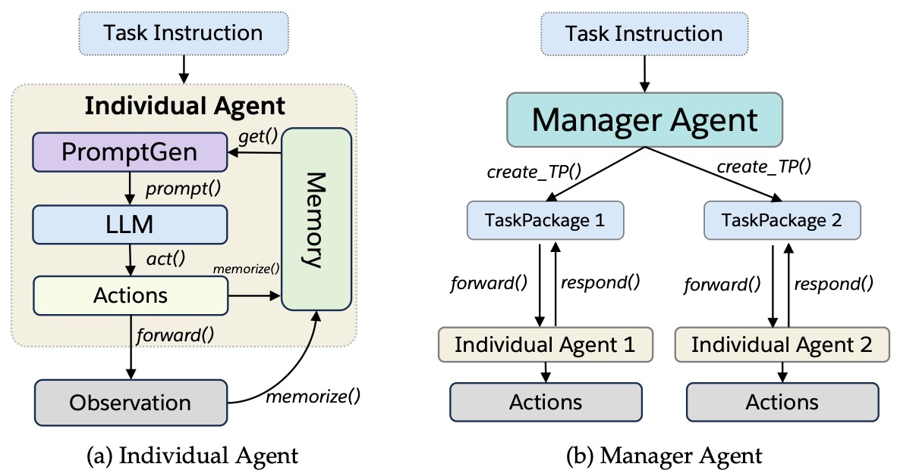

<div align="center">
  <a href="https://github.com/SalesforceAIResearch/AgentLite/tree/main"></a>
</div>

<br/>

<div align="center">

  [](https://github.com/SalesforceAIResearch/AgentLite/releases)
  
  [](https://pypi.org/project/agentlite-llm)
  []()
  [](https://star-history.com/#SalesforceAIResearch/AgentLite)

</div>

<p align="center">
  <a href="https://arxiv.org/abs/2402.15538">Paper</a> |
  <a href="https://github.com/SalesforceAIResearch/AgentLite/tree/main?tab=readme-ov-file#-key-features">Key Features</a> |
  <a href="https://github.com/SalesforceAIResearch/AgentLite/tree/main?tab=readme-ov-file#%EF%B8%8F-installation">Installation</a> |
  <a href="https://github.com/SalesforceAIResearch/AgentLite/tree/main?tab=readme-ov-file#-quick-start">Quick Start</a> |
  <a href="https://github.com/SalesforceAIResearch/AgentLite/tree/main?tab=readme-ov-file#-examples">Examples</a> |
  <a href="https://github.com/SalesforceAIResearch/AgentLite/tree/main?tab=readme-ov-file#-tutorials">Tutorials</a> |
  <a href="https://github.com/SalesforceAIResearch/AgentLite/tree/main?tab=readme-ov-file#-benchmark">Benchmark</a>
</p>

---

AgentLite is a research-oriented library designed for building and advancing LLM-based task-oriented agent systems. It simplifies the implementation of new agent/multi-agent architectures, enabling easy orchestration of multiple agents through a manager agent. Whether you're building individual agents or complex multi-agent systems, AgentLite provides a straightforward and lightweight foundation for your research and development. Check more details in [our paper](https://arxiv.org/abs/2402.15538).

## 🎉 News
- **[04.2024]** [UI Supporting](./app/Homepage.py) is released for AgentLite! 
- **[03.2024]** [xLAM model](https://huggingface.co/collections/Salesforce/xlam-models-65f00e2a0a63bbcd1c2dade4) and [xLAM code](https://github.com/SalesforceAIResearch/xLAM) is released! Try it with [AgentLite benchmark](./benchmark/), which is comparable to GPT-4!
- **[03.2024]** We developed all the agent architectures in [BOLAA](https://arxiv.org/pdf/2308.05960.pdf) with AgentLite. Check our [new benchmark](./benchmark/)
- **[02.2024]** Initial Release of AgentLite library and [paper](https://arxiv.org/abs/2402.15538)!

## 🌟 Key Features

- **Lightweight Codebase**: Designed for easy implementation of new Agent/Multi-Agent architectures.
- **Task-oriented LLM-based Agents**: Focus on building agents for specific tasks, enhancing their performance and capabilities.
- **Research-oriented Design**: A perfect tool for exploring advanced concepts in LLM-based multi-agent systems.

## 🤖 Framework



## 🛠️ Installation

To get started with AgentLite, clone the repository and install the package using the following commands:

```shell
git clone https://github.com/SalesforceAIResearch/AgentLite.git
cd AgentLite
pip install -e .
```

Ensure you check the package dependencies and requirements in `requirements.txt` and `setup.py`.

## 🚀 Quick Start

To use AgentLite, set your OpenAI API key and run one of the example scripts:

```shell
export OPENAI_API_KEY=<INSERT YOUR OpenAI API KEY HERE>
python ./example/SearchManager.py
```

## 🖥️ UI Supporting
We provide a simple UI feature with AgentLite for demo purpose. To enable this capbility, uncomment the UI parts in [requirements.txt](./requirements.txt) to install the steamlite package.
After installation, start with
```shell
streamlit run app/Homepage.py
```
Check our recorded UI demo.


## 🔍 Examples

### Building Individual Agents

Build a Wikipedia search agent by providing a specific search action. For the full source, see [SearchAgent.py](./example/SearchAgent.py).

**1. Define the Action of an Agent**

```python
from agentlite.actions.BaseAction import BaseAction
from langchain_community.tools import WikipediaQueryRun

class WikipediaSearch(BaseAction):
    def __init__(self) -> None:
        action_name = "Wikipedia_Search" 
        action_desc = "Using this API to search Wiki content." # LLM uses action_name and action_desc to understand this action
        params_doc = {"query": "the search string. be simple."} # LLM uses this params_doc to understand the parameters in self.__call__() function
        self.search = WikipediaQueryRun(api_wrapper=WikipediaAPIWrapper())
        super().__init__(
            action_name=action_name,
            action_desc=action_desc,
            params_doc=params_doc,
        )

    def __call__(self, query):
        return self.search.run(query)
```

**2. Define an Agent with the Search Action**

```python
# get the llm for agent. Should already export OPENAI_API_KEY="" in the your terminal if you use OPENAI_API.
llm_config_dict = {"llm_name": "gpt-3.5-turbo", "temperature": 0.9}
llm_config = LLMConfig(llm_config_dict)
llm = get_llm_backend(llm_config)
# define an individual agent
search_agent_info = {
    "name": "search_agent",
    "role": "you can search wikipedia to get the information."
}
search_agent = BaseAgent(name=search_agent_info["name"], 
                         role=search_agent_info["role"], 
                         llm=llm, 
                         actions=[WikipediaSearch()], 
                         logger=agent_logger
                         )
```

**3. Calling the Agent with a Task**

```python
# calling the agent with TaskPackage
from agentlite.commons import TaskPackage
test_task = "what is the found date of microsoft"
test_task_pack = TaskPackage(instruction=test_task)
response = search_agent(test_task_pack)
print("response:", response)
```

### Building a Multi-Agent System

Orchestrate different search agents into a multi-agent system. For full source, see [simple_manager.py](./example/simple_manager.py).

**1. Define Individual Agents**

```python
# define two different types search agents
## get llm backend
from agentlite.llm.agent_llms import get_llm_backend
from agentlite.llm.LLMConfig import LLMConfig
llm_config_dict = {
    "llm_name": "gpt-3.5-turbo",
    "temperature": 0.9,
    "context_len": 4000,
}
llm_config = LLMConfig(llm_config_dict)
llm = get_llm_backend(llm_config)
## get individual agents
from example.SearchAgent import WikiSearchAgent, DuckSearchAgent
wiki_search_agent = WikiSearchAgent(llm)
duck_search_agent = DuckSearchAgent(llm)
```

**2. Define a Manager Agent**

```python
from agentlite.agents import ManagerAgent
manager_agent_info = {
    "name": "search_manager",
    "role": "you are controlling wiki_search_agent and duck_search_agent to complete the search task. You should first use wiki_search_agent to complete the search task. If didn't answer the task, please try to ask duck_search_agent. You should integrate the answer from both agent to finalize the task."
}
# simply initializing the manager with info and the TeamAgents.
search_manager = ManagerAgent(llm, manager_agent_info["name"], 
                              manager_agent_info["role"],
                              TeamAgents=[wiki_search_agent, duck_search_agent])
```

**3. Test the Manager Agent with a TaskPackage**

```python
from agentlite.commons import TaskPackage
test_task = "what is salesforce famous for?"
test_task_pack = TaskPackage(instruction=test_task, task_creator="User")
response = search_manager(test_task_pack)
print(response)
```

running the test in terminal. You will see the running output like following:
```
Agent search_manager receives the following TaskPackage:
[
        Task ID: 6f6bffdd-1ba8-4f7c-b326-8f409865fef0
        Instruction: what is salesforce famous for?
]
====search_manager starts execution on TaskPackage 6f6bffdd-1ba8-4f7c-b326-8f409865fef0====
Agent search_manager takes 0-step Action:
{
        name: wiki_search_agent
        params: {'Task': 'What is salesforce famous for?'}
}
``` 

## 📘 [Tutorials](./tutorials/)

- [Building Search Agent](./tutorials/building_search_agent.ipynb)
- [Building a Multi-Agent Searching System](./tutorials/building_multi_agent_system.ipynb)
- [Two Agent in Chess Game](./tutorials/chess_game.ipynb)
- [Math Problem Solving](./tutorials/math_problem_solving.ipynb)
- [Interactive Image Understanding](./tutorials/interactive_image_understanding.ipynb)
- [Multi_LLM_QA](./tutorials/multi_LLM_QA.ipynb) 
- [Search_and_Paint](./tutorials/search_and_paint.ipynb)
- [Philosophers_chatting](./tutorials/philosophers_chatting.ipynb)

For detailed examples and tutorials on how to utilize AgentLite for your research or projects, please visit the [tutorials directory](./tutorials/).

## 🔬 [Benchmark](./benchmark/)
- [HotpotQA](./benchmark/hotpotqa/evaluate_hotpot_qa.py)
- [Webshop](./benchmark/webshop/evaluate_webshop.py)
- [Tool-query](./benchmark/tool/evaluate_tools.py)
- [Tool-operation](./benchmark/tool-operation/evaluate_tool_operation.py)

## Citation
If you find our paper or code useful, please cite
```
@misc{liu2024agentlite,
      title={AgentLite: A Lightweight Library for Building and Advancing Task-Oriented LLM Agent System}, 
      author={Zhiwei Liu and Weiran Yao and Jianguo Zhang and Liangwei Yang and Zuxin Liu and Juntao Tan and Prafulla K. Choubey and Tian Lan and Jason Wu and Huan Wang and Shelby Heinecke and Caiming Xiong and Silvio Savarese},
      year={2024},
      eprint={2402.15538},
      archivePrefix={arXiv},
      primaryClass={cs.MA}
}
```

## Acknowledgement
- We use some great tools in [Langchain](https://github.com/langchain-ai/langchain) to build the examples and the library LLM call

## Contact
Please reach out to us if you have any questions or suggestions. You can submit an issue or pull request, or send an email to zhiweiliu@salesforce.com
